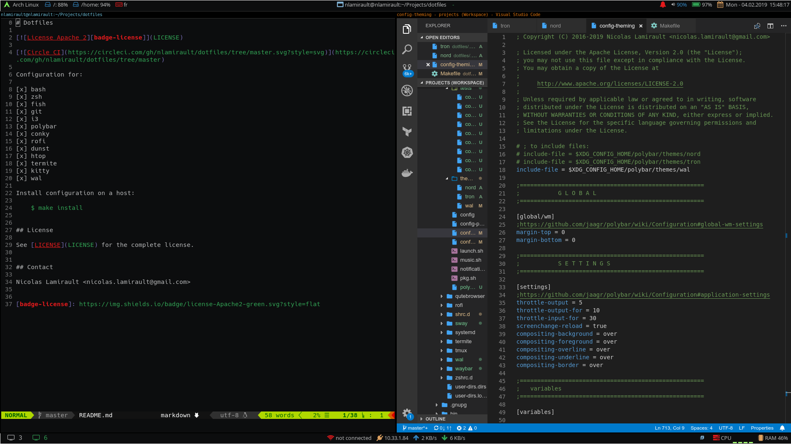

# Dotfiles

[![License Apache 2][badge-license]](LICENSE)

Configuration for:

[x] bash
[x] zsh
[x] fish
[x] git
[x] i3
[x] polybar
[x] conky
[x] rofi
[x] dunst
[x] htop
[x] termite
[x] kitty
[x] wal

Install configuration on a host:

    $ make install

## License

See [LICENSE](LICENSE) for the complete license.

## Contact

Nicolas Lamirault <nicolas.lamirault@gmail.com>

[badge-license]: https://img.shields.io/badge/license-Apache2-green.svg?style=flat
